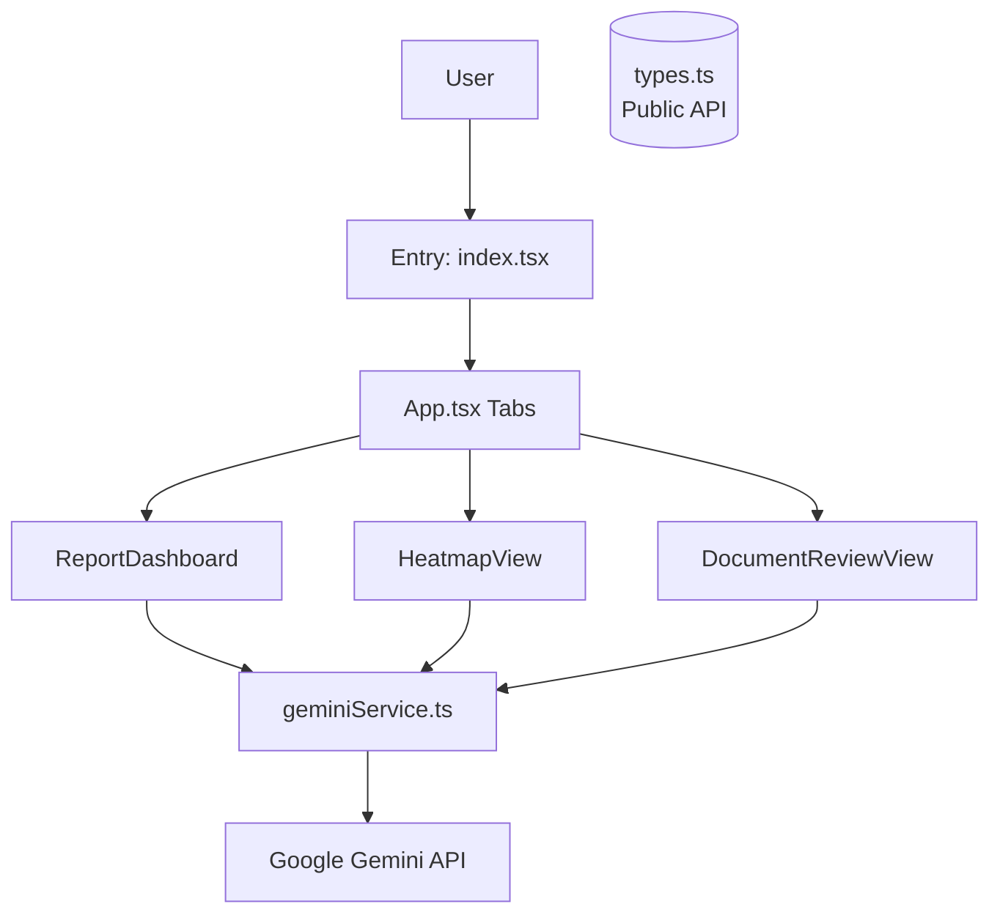
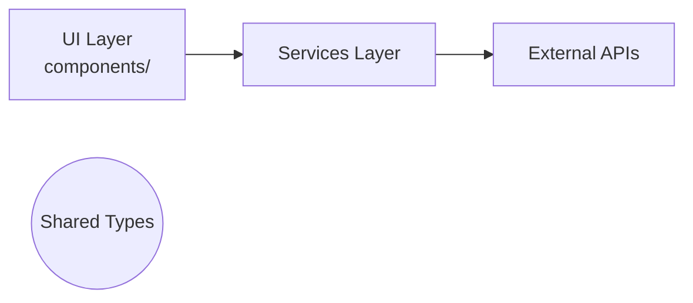

# Architecture Documentation

This document describes the high-level architecture of the **Simulador de Impacto - Auditoria de Criativos** application, a React-based web tool for auditing creative assets (e.g., ads) using AI-driven analysis via Google Gemini. The app provides interactive dashboards, heatmaps, and document reviews to simulate impact and generate feedback.

## System Architecture Overview

**Topology**: Monolithic client-side single-page application (SPA).  
**Tech Stack**: React 18+, Vite (build tool), TypeScript, Tailwind CSS (inferred from typical setup).  
**Deployment Model**: Static hosting (e.g., Vercel, Netlify, or GitHub Pages). No backend server; all logic runs in the browser.

**Request Flow**:
1. User loads `index.html` → `index.tsx` renders `<App />`.
2. `<App />` manages routing/tabs (`AppTab` type) between views (Dashboard, Heatmap, Document Review).
3. User actions (e.g., upload creative) trigger services like `geminiService.ts`.
4. Service calls Google Gemini API → Returns `AnalysisResult`, `PersonaImpact`, `AgentFeedback`.
5. Results rendered via components (`ReportDashboard`, `HeatmapView`, `DocumentReviewView`).
6. Data stored in local state (React Context or Redux-like, TBD).

No database; ephemeral client-side state. Persist via localStorage if needed.

```
User → Browser (SPA) → Components → Services → Gemini API → Results → UI
```

## Architectural Layers

### UI Layer (`components/`)
Reusable React components for views and dashboards. 3 main components:
- `ReportDashboard.tsx` (`ReportDashboardProps`): Aggregates analysis results into charts/tables.
- `HeatmapView.tsx` (`HeatmapViewProps`): Visualizes impact heatmaps (e.g., attention scores on creatives).
- `DocumentReviewView.tsx` (`DocumentReviewViewProps`): Displays AI feedback on documents/uploads.

**Conventions**: Functional components with hooks. Props interfaces defined inline.

### Services Layer (`services/`)
Thin API wrappers:
- `geminiService.ts`: Orchestrates Gemini API calls for creative analysis. Returns typed results (`AnalysisResult`, `PersonaImpact`).

### Types & Contracts (`types.ts`)
Central shared interfaces (all exported, public API):
- `AgentFeedback`: Structured AI feedback.
- `PersonaImpact`: Impact scores per persona.
- `AnalysisResult`: Full analysis output.
- `Message`: Chat-like message history.

### App & Routing (`App.tsx`)
Tab-based navigation (`AppTab` type). Entry orchestration.

### Commands (`commands/`, 18 files)
CLI scripts or codegen tools (e.g., for scaffolding tests/docs). Run via `npm run` scripts.

### Tests (`tests/`, `playwright.config.ts`)
E2E testing with Playwright.

## Detected Design Patterns

- **Component Composition**: Views compose smaller UI pieces (e.g., Dashboard uses charts).
- **Service Isolation**: Business logic (AI calls) separated from UI.
- **Type-First Design**: Strict TypeScript interfaces enforce contracts.
- **Provider Pattern** (likely): Context for shared state (e.g., analysis results).
- **Hooks over HOCs**: Modern React patterns.

No advanced patterns like Redux/Saga detected yet; lightweight state management.

## Entry Points

- **`index.tsx`**: Root renderer. Mounts `<App />` to `#root`.
  ```tsx
  // index.tsx (inferred)
  import React from 'react';
  import ReactDOM from 'react-dom/client';
  import App from './App.tsx';
  ReactDOM.createRoot(document.getElementById('root')!).render(<App />);
  ```

## Public API

| Symbol | Type | Location | Description |
|--------|------|----------|-------------|
| [`AgentFeedback`](types.ts#L2) | `interface` | `types.ts:2` | AI agent feedback structure. |
| [`PersonaImpact`](types.ts#L9) | `interface` | `types.ts:9` | Impact metrics per user persona. |
| [`AnalysisResult`](types.ts#L14) | `interface` | `types.ts:14` | Complete analysis output from Gemini. |
| [`Message`](types.ts#L31) | `interface` | `types.ts:31` | Message in conversation/review history. |

Import as: `import { AnalysisResult } from './types.ts';`

## Internal System Boundaries

- **UI ↔ Services**: Props/state only; no direct API calls in components.
- **Services ↔ Gemini**: Typed responses; error handling centralized.
- **No Backend Boundaries**: Pure frontend. LocalStorage for persistence seam.
- **Domains**: Creative Analysis (core), Visualization (UI), Reporting (Dashboard).

Data ownership: Client-side only. Sync via API polling if multi-tab needed.

## External Service Dependencies

| Service | Purpose | Auth | Rate Limits | Failure Handling |
|---------|---------|------|-------------|------------------|
| **Google Gemini API** (`geminiService.ts`) | Creative analysis, feedback generation. | API Key (env: `VITE_GEMINI_API_KEY`) | Model-dependent (e.g., 60 RPM for Gemini 1.5 Flash). | Retry with exponential backoff; fallback UI messages. Offline mode stub results. |

**Security Note**: API key exposed client-side. Use for dev/demo only; proxy via backend for prod.

## Key Decisions & Trade-offs

| Decision | Rationale | Alternatives | Trade-offs |
|----------|-----------|--------------|------------|
| **Client-side Gemini** | Fast prototyping, no infra. Interactive real-time analysis. | Serverless proxy (Cloud Functions). | Key exposure vs. simplicity. |
| **Vite + React** | Hot reload, TS support, small bundle. | CRA/Next.js. | No SSR → SEO irrelevant for tool. |
| **Tab-based App** | Simple SPA nav without router bloat. | React Router. | Less flexible for complex routes. |
| **Playwright E2E** | Cross-browser, visual regression for UI-heavy app. | Jest only. | Heavier setup. |

**ADRs**: None formalized; evolve via PRs. See `technical_architecture.md`.

## Diagrams

### Component Diagram


### Layered Architecture


## Risks & Constraints

- **Performance**: Large creatives → Slow Gemini inference (5-30s). Mitigate: Progress indicators, caching.
- **Costs**: Gemini usage fees. Monitor via Google Console.
- **Scaling**: Client-only; scales infinitely but API-bound.
- **Offline**: Degrades gracefully (stub data).
- **Browser Compat**: Modern browsers (Playwright-tested).
- **Constraints**: No user auth/DB; single-user tool.

## Top Directories Snapshot

```
.
├── App.tsx                 # App orchestration
├── commands/               # 18 CLI/codegen scripts (~18 files)
├── components/             # UI views (~3 files)
├── services/               # API wrappers (~1 file)
├── tests/                  # Playwright E2E (~1 file)
├── docs/                   # This repo (~5 files)
├── index.tsx               # Entry point
├── types.ts                # Shared types
├── package.json            # Deps: React, Vite, @google/generative-ai
├── vite.config.ts          # Build config
└── playwright.config.ts    # Testing
```

**File Count**: ~50 total (lightweight).

## Related Resources

- [Project Overview](./project-overview.md)
- [System Documentation](./system_documentation.md)
- [Technical Architecture](./technical_architecture.md)
- [Product Requirements](./product_requirements_document.md)
- Update [agents/README.md](../agents/README.md) on AI changes.
- **Extending**: Add new tabs in `App.tsx`; new services in `services/`.

For developers: Fork → `npm i` → `npm run dev` → Edit components/services → Test w/ Playwright.
